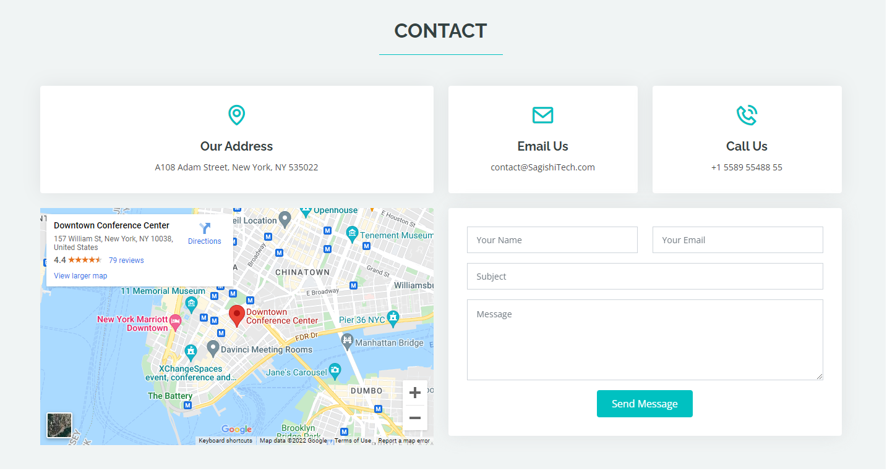
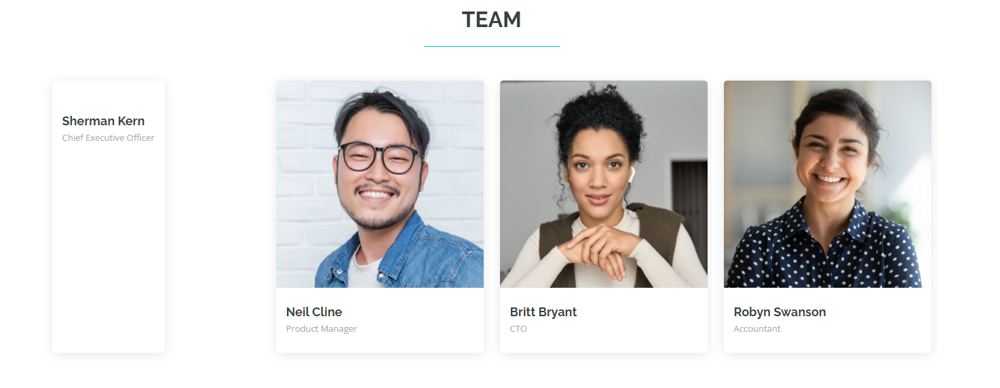
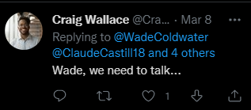

# MISC

## PUBLIC PANIC - 403 pts

- Decription:

    I don't think this company's security is all that great. Let's see if we can find anything by doing some open source intellegence.

- Link: http://misc2.utctf.live:8756/

We have the website, landing page of a copany name Sagishi Tech. At first, I was looking at the ***Contact*** part and though it was a web vulnerability. 

But I failed to RCE since they blocked it.

Then I realize there are twitter accounts.

(The UI is kinda bug rn)

I looked at the following/followed part and noticed some differences.

Here are some names that I think standout: Sidney Jaggers, Cliff Shackleford, Debby Uselton.

I continued to look at those accounts, get some more names: Wade Coldwater, Claude Castillo.

Wade Coldwater's account has something to look at, and I found the flag in this picture.


Flag: utflag{situational_awareness_is_key}



Yeah definitely...


## PUBLIC PANIC 2 - 946 pts

- Decription:

    With the information we got from the previous problem we can surely get on their system!
    For this challenge you can run nmap, but only against misc2.utctf.live on port 8622.

- Link: misc2.utctf.live:8622

The link above is unaccessible, so I try to ssh to it. To ssh, we need usrname and pw. Looking back to the previous challenge, I found the password right above the flag - ***defaultpw5678!***

Now the usrname, it must be the name of the employees, so I try every single one (with '_' or '-' or '.' in between first and last name), failed. Then I try with shorter name: last name, first name, flastname (cwallace for instance)... and finally the correct one was ***cshackleford***

```
ssh cshackleford@misc2.utctf.live -p 8622
password: defaultpw5678!
```

Connected !!!

There is flag.txt file, `cat flag.txt` and here's the flag: 

utflag{conventions_knowledge_for_the_win}